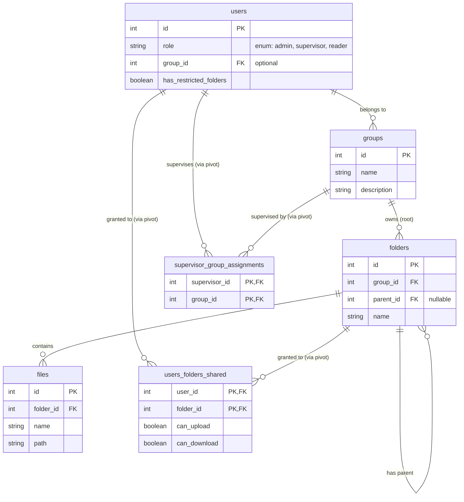

# Plan de Actualización: Paradigma Documental y de Permisos

Este documento describe la arquitectura y el plan de implementación para la reestructuración de la base de datos y la lógica de permisos de la aplicación. El objetivo es transicionar a un modelo de aislamiento por empresa (utilizando el modelo **Group**) con permisos granulares por usuario y roles definidos.

## 1. Objetivos del Nuevo Paradigma

- **Aislamiento de Datos:** Las carpetas y archivos pertenecen estrictamente a un `Group` (Empresa raíz).
- **Visibilidad Granular:** Acceso a carpetas controlado a nivel de usuario mediante tablas pivote.
- **Sistema de Roles (RBAC):**
  - **Admin:** Acceso global a todas las empresas (`Group`), carpetas y configuraciones.
  - **Supervisor:** Acceso de gestión a una o múltiples empresas (`Group`) asignadas. No tiene acceso a configuración global ni papelera.
  - **Reader:** Acceso restringido a su propia empresa (`Group`). Por defecto ve todo en su empresa, pero puede ser restringido a carpetas específicas mediante asignaciones.

## 2. Diagrama Entidad-Relación (ER)

## 3. Plan de Implementación Realizado

La implementación se organizó en las siguientes fases:

### Fase 1: Actualización del Esquema de Base de Datos (Migraciones)
1. **Unificación en `groups` (Empresas):**
   - Se consolidó el modelo `Group` para representar a las Empresas en el sistema.
2. **Modificación de la tabla `users`:**
   - Campo `role` (enum: `admin`, `supervisor`, `reader`).
   - Foreign key `group_id` (vincular usuario a su Empresa/Grupo principal).
   - Campo `has_restricted_folders` (boolean).
3. **Modificación de la tabla `folders`:**
   - Foreign key `group_id` (para atar la carpeta a su Empresa/Grupo raíz).
   - Foreign key `parent_id` (para jerarquía de subcarpetas).
4. **Tablas pivote:**
   - `users_folders_shared` (`user_id`, `folder_id`, `can_upload`, `can_download`).
   - `supervisor_group_assignments` (`supervisor_id`, `group_id`).

### Fase 2: Modelos y Relaciones (Eloquent)
1. **Modelo `User`:**
   - Relaciones `group()`, `supervisedGroups()`, `allowedFolders()`.
   - Helpers: `isAdmin()`, `isSupervisor()`, `isReader()`.
2. **Modelo `Group`:**
   - Relaciones `directFolders()`, `directUsers()`, `supervisors()`.
3. **Modelo `Folder`:**
   - Relaciones `group()`, `parent()`, `children()`, `fileDocuments()`, `sharedWithUsers()`.
   - Query Scope `scopeForCurrentUser($query)` para aplicar restricciones automáticas según el usuario autenticado.

### Fase 3: Capa de Seguridad y Autorización (Policies)
1. **`FolderPolicy`:**
   - Pase libre para `admin`.
   - Restricciones en `view()`, `create()`, `update()`, `delete()` basadas en `group_id` del usuario o sus `supervisedGroups`.

### Fase 4: Interfaz de Usuario y Paneles (Filament PHP)
1. **[GroupResource](file:///Users/franc/Herd/visor-contable/app/Filament/Resources/GroupResource.php):**
   - Configurado bajo la etiqueta visual "Empresas", accesible por administradores.
2. **[SupervisorGroupAssignmentResource](file:///Users/franc/Herd/visor-contable/app/Filament/Resources/SupervisorGroupAssignmentResource.php):**
   - Recurso para asignar Empresas (Grupos) a los Supervisores.
3. **[UserResource](file:///Users/franc/Herd/visor-contable/app/Filament/Resources/UserResource.php) y [FolderResource](file:///Users/franc/Herd/visor-contable/app/Filament/Resources/FolderResource.php):**
   - Integrados con `group_id` y filtrado transparente.